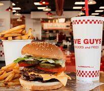

<html>
<head>
    <title>Yemt</title>
    
</head>
<body>
    <h1>yemt</h1>
    

        
        
מידע נוסף

    

    <h2>Five Guys מתכוונת לפתוח סניף בתל אביב(ישראל) בשנת 2024</h2>
    
Five Guys, הרשת הידועה של מסעדות הבורגרים האמריקאית, תפתח את הסניף הראשון שלה בישראל בשנת 2024. החברה, המוכרת בעיקר בארה"ב, כבר רואה את הפוטנציאל בשוק הישראלי ומתכננת להביא את טעמי הבורגרים המוכרים שלה לגולת המזרח התיכון.

    
Five Guys מציעה מגוון רחב של בורגרים וצדות, עם דגש על איכות המרכיבים והטעם המצוין. הבורגרים מוכנים באופן מותאם אישית לפי בחירת הלקוח, וזאת הסיבה שהרשת זכתה לפופולריות רבה ברחבי העולם.

    
הצלחתה של Five Guys נבנתה על יסוד של איכות ושירות מצוינים. בנוסף, הרשת דואגת לשמור על אווירה נעימה ואורבנית במסעדותיה, ומתייחסת בכבוד רב לצרכי הלקוחות שלה.

    
נדב נמתחת, מנהל פיתוח הרשת בישראל, אמר: "אנחנו מאוד מתרגשים מפתיחת הסניף הראשון של Five Guys בישראל. חוויית הבורגרים המצוינת והאיכות הגבוהה של הרשת יתרמו הרבה לתרבות הקולינרית במדינתנו".

</body>
</html>

